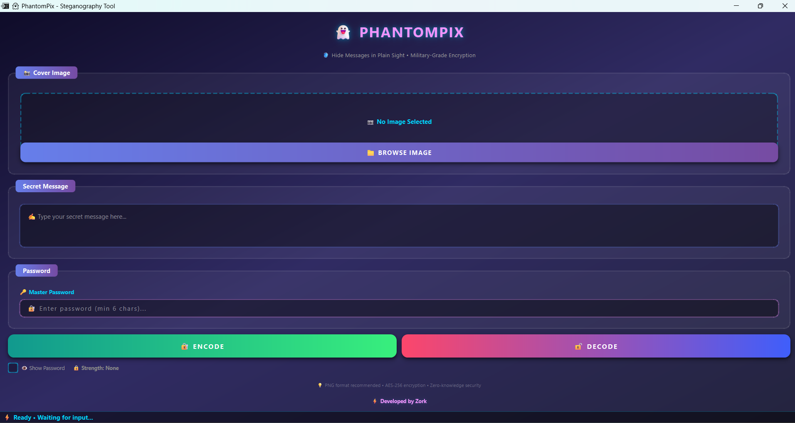

# 👻 PhantomPix - Advanced Steganography Tool

<div align="center">




**Hide Messages in Plain Sight • Military-Grade Encryption**

[Features](#-features) • [Installation](#-installation)  • [Security](#-security)

</div>

---

## 🎯 Overview

PhantomPix is a cutting-edge steganography application that allows you to hide encrypted messages inside images. Using advanced AES-256 encryption combined with LSB (Least Significant Bit) steganography, your secrets remain invisible to the naked eye.

Perfect for:
- 🔐 Secure communication
- 🕵️ Privacy-conscious individuals
- 🎓 Educational purposes
- 🔬 Security research

---

## ✨ Features

### 🛡️ Security First
- **AES-256 Encryption** - Military-grade encryption for your messages
- **Password-Based Key Derivation** - SHA-256 hashing for secure key generation
- **Data Compression** - Zlib compression before encryption
- **Integrity Verification** - SHA-256 checksums to detect tampering
- **Zero-Knowledge Architecture** - Your data never leaves your device


### 🚀 Performance
- **Fast Processing** - Optimized algorithms for quick encoding/decoding
- **Large Message Support** - Hide substantial amounts of text
- **Multiple Image Formats** - Support for PNG, JPG, JPEG, BMP
- **Lossless Storage** - PNG output preserves hidden data perfectly

---

## 📦 Installation

### Prerequisites
- Python 3.13.3 or higher
- Windows 10/11 (tested)

### Step 1: Clone the Repository
```bash
git clone https://github.com/samay825/PhantomPix.git
cd PhantomPix
```

### Step 2: Install Dependencies
```bash
pip install -r requirements.txt
```

### Step 3: Run the Application


**Option : Using the Batch File (Windows)**
```bash
PhantomPix.bat
```
*The batch file automatically requests administrator privileges if needed.*

---

## 🎮 Usage

### Encoding a Message

1. **Select Cover Image**
   - Click "📁 BROWSE IMAGE" button
   - Choose an image file (PNG recommended for best results)

2. **Enter Your Secret Message**
   - Type your message in the text area
   - Can be any length (limited by image size)

3. **Set a Strong Password**
   - Enter a password (minimum 6 characters)
   - Watch the strength indicator for feedback
   - 🟢 Strong passwords use uppercase, numbers, and symbols

4. **Encode**
   - Click "🔐 ENCODE" button
   - Choose where to save the encoded image
   - Done! Your message is now hidden

### Decoding a Message

1. **Select Encoded Image**
   - Click "📁 BROWSE IMAGE" button
   - Choose the image containing the hidden message

2. **Enter Password**
   - Type the same password used during encoding

3. **Decode**
   - Click "🔓 DECODE" button
   - Your secret message will appear in the text area

---

## 📸 Screenshots

### Main Interface
```
┌─────────────────────────────────────────┐
│         👻 PHANTOMPIX                  
│  🛡️ Hide Messages in Plain Sight       
├─────────────────────────────────────────┤
│  📸 Cover Image                        
│  ┌───────────────────────────────────┐  │
│  │     [Image Preview Area]          │  │
│  └───────────────────────────────────┘  │
│  [📁 BROWSE IMAGE]                     
├─────────────────────────────────────────┤
│  💬 Secret Message                     
│  ┌───────────────────────────────────┐  │
│  │ Type your message here...         │  │
│  └───────────────────────────────────┘  │
├─────────────────────────────────────────┤
│  🔑 Password                           
│  [🔐 Enter password...]                 
│  👁️ Show Password  🟢 Strength: Strong │
├─────────────────────────────────────────┤
│  [🔐 ENCODE]        [🔓 DECODE]        │
└─────────────────────────────────────────┘
```

---

## 🔒 Security

### Encryption Details
- **Algorithm**: AES-256 (Fernet)
- **Key Derivation**: SHA-256
- **Compression**: Zlib (optional, enabled by default)
- **Integrity Check**: SHA-256 checksum

### Steganography Method
- **Technique**: LSB (Least Significant Bit) modification
- **Color Channels**: RGB (Alpha channel preserved)
- **Magic Marker**: Custom header for data identification
- **Format**: PNG (lossless compression)

### Best Practices
✅ Use strong, unique passwords (12+ characters)  
✅ Save encoded images as PNG format  
✅ Don't modify encoded images (no cropping, resizing, or filters)  
✅ Keep your password safe and secure  
✅ Use large images for better capacity  

❌ Don't share your password  
❌ Don't compress encoded images (JPEG compression destroys data)  
❌ Don't use weak passwords  

---

## 🛠️ Technical Details


### Dependencies
```
PyQt6>=6.4.0              # Modern GUI framework
Pillow>=9.0.0             # Image processing
cryptography>=38.0.0      # AES encryption
```

### Capacity Calculation
Maximum message size depends on image dimensions:
```
Max Bytes = (Width × Height × 3) / 8 - 16
```
Example: A 1920×1080 image can hide ~777 KB of data

---


## 👨‍💻 Author

**Zork**

- GitHub: [@samay825](https://github.com/samay825)
- Email: sincryptzork@gmail.com

---


## ⚠️ Disclaimer

This tool is provided for educational and legitimate privacy purposes only. Users are responsible for complying with all applicable laws and regulations. The author assumes no liability for misuse of this software.


---

<div align="center">

**Made with ❤️ by Zork**

⭐ Star this repo if you find it useful!

[Report Bug](https://github.com/samay825/PhantomPix/issues) • [Request Feature](https://github.com/samay825/PhantomPix/issues)

</div>
